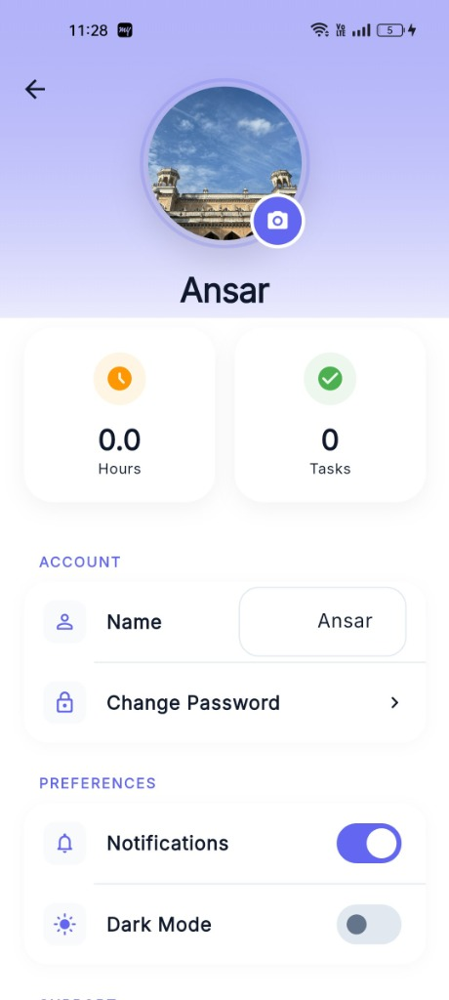
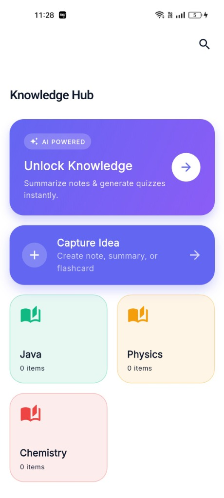
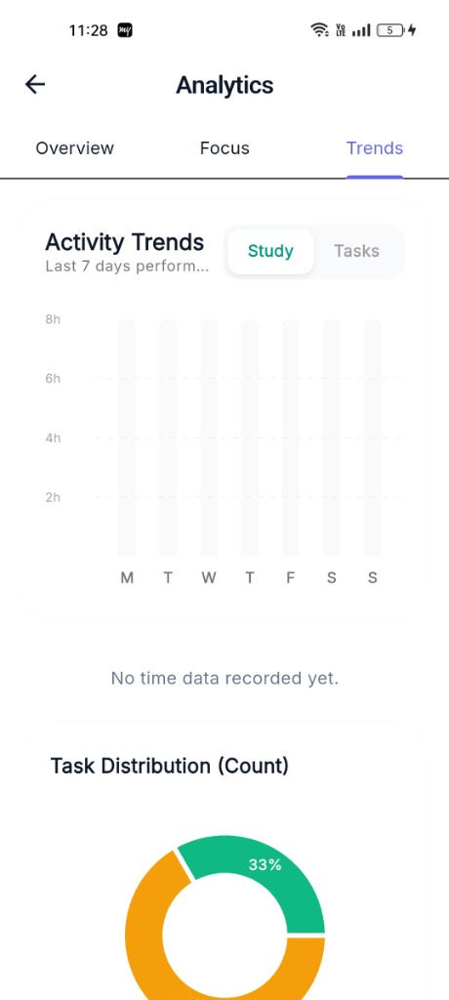
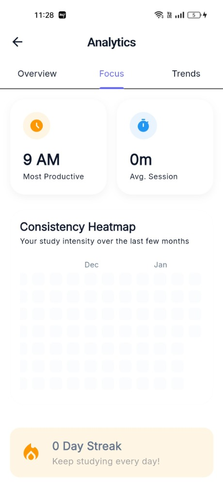
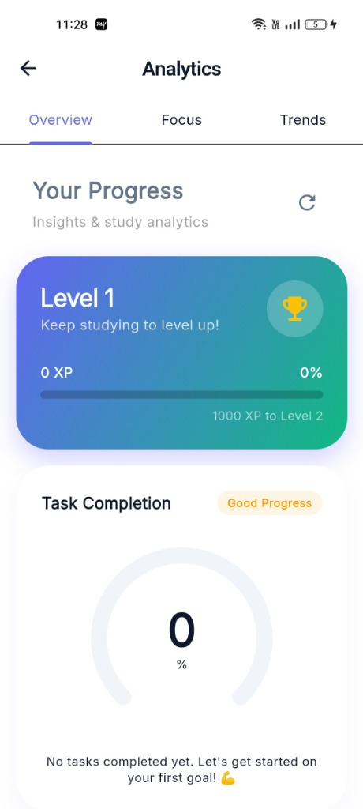

# 🎓 Smart Study Plan

**Smart Study Plan** is a comprehensive Flutter application designed to help students organize their learning, track progress, and boost productivity. With features like AI-powered study assistance, detailed analytics, and a gamified experience, it transforms the way you study.

## ✨ Key Features

### 🔐 User Management & Security
- **Secure Authentication**: Power-packed with Firebase Authentication for Email/Password login.
- **Google Sign-In**: Quick and easy access using Google credentials.
- **Onboarding Flow**: Smooth introduction to app features for new users.

### 📚 Study & Organization
- **Subject Management**: Create and color-code subjects to organize your study load.
- **Task Management**:
  - Create, edit, and delete tasks.
  - Set priorities (Low, Medium, High).
  - Track status (To Do, In Progress, Completed).
- **Resource Library**:
  - Upload and manage study materials (PDFs, Images, Notes).
  - Organize resources by subject.
  - Track storage usage.

### ⏱️ Productivity Tools
- **Study Planner**: Schedule study sessions efficiently.
- **Focus Timer**: Built-in session timer to track actual study time vs. planned time.
- **Sessions Tracking**: Log completed sessions and duration.

### 🤖 Knowledge Hub (AI)
- **AI Companion**: Chat with an AI assistant for study help.
- **Smart Suggestions**: Get AI-generated task breakdowns and study tips.
- **Knowledge Base**: Store and retrieve AI-generated insights.

### 📊 Analytics & Gamification
- **Consistency Heatmap**: Visual representation of your daily study habits (GitHub-style).
- **Performance Gauges**: Track your efficiency and completion rates.
- **Subject Distribution**: See where you spend most of your time.
- **Points & Rewards**: Gamified elements to keep you motivated.

### 🔔 Notifications
- **Smart Reminders**: Get notified before tasks are due.
- **Study Alarms**: Custom alarms for your scheduled sessions.

### ⚙️ Admin & Settings
- **Admin Panel**: Dashboard for managing users and system metrics.
- **Dark Mode**: Fully supported dark theme for late-night study sessions.
- **Profile Management**: Update your details and preferences.

## 📱 Screenshots

| User Profile | Knowledge Hub | Analytics Trends |
|:---:|:---:|:---:|
|  |  |  |

| Analytics Focus | Your Progress |
|:---:|:---:|
|  |  |

## 🛠️ Technology Stack

- **Framework**: [Flutter](https://flutter.dev/) (Dart)
- **State Management**: [flutter_bloc](https://pub.dev/packages/flutter_bloc)
- **Backend**: [Firebase](https://firebase.google.com/) (Auth, Firestore, Storage)
- **Local Storage**: [shared_preferences](https://pub.dev/packages/shared_preferences)
- **Charts**: [fl_chart](https://pub.dev/packages/fl_chart)
- **Dates**: [intl](https://pub.dev/packages/intl)
- **AI Integration**: Gemini API (via package)

## 🚀 Getting Started

1.  **Clone the repository**:
    ```bash
    git clone https://github.com/ansar7787/smart-study-plan.git
    ```

2.  **Install dependencies**:
    ```bash
    flutter pub get
    ```

3.  **Firebase Setup**:
    - Ensure you have `google-services.json` (Android) and `GoogleService-Info.plist` (iOS) placed in their respective folders.
    - Enable Authentication (Email/Google), Firestore, and Storage in your Firebase Console.

4.  **Run the app**:
    ```bash
    flutter run
    ```

## 🤝 Contributing

Contributions are welcome! Please fork the repository and submit a pull request.

## 📄 License

This project is licensed under the MIT License - see the LICENSE file for details.
